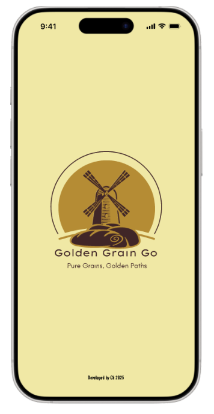
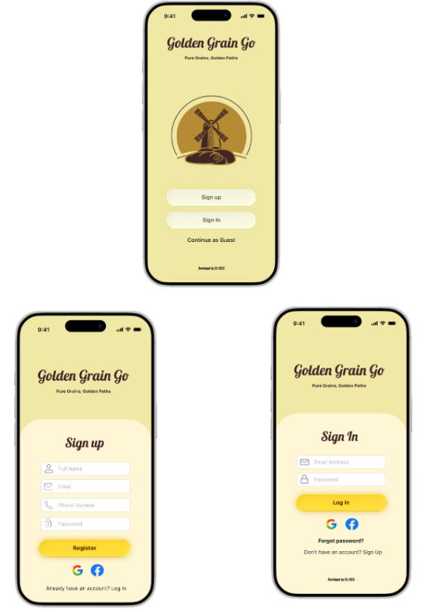
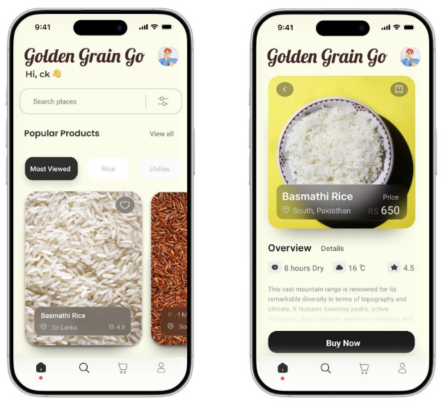

# 🌾 Golden Grain Go: Rice & Mill Item Buyer App  

Golden Grain Go is a **prototype mobile application** developed using **Android Studio**.  
It focuses on **UI design and navigation flow only** (no backend, validation, or database integration).  
The app demonstrates how customers would browse and purchase rice and mill products in the future full version.  

---

## ✨ Features (UI Only)
- 📱 **Splash Screen** with logo and tagline.  
- 🔐 **Authentication Screens** (Sign Up, Sign In, Guest Access).  
- 🛒 **Navigation Flow** between signup, signin, and product pages.  
- 🔍 **Product Browsing UI** with search bar and categories.  
- 📄 **Product Details UI** with image, description, and price.  

⚠️ **Note**: This version only includes **front-end navigation**.  
No authentication, validation, or database connection is implemented yet.  

---

## 📸 Screenshots  

### Splash & Authentication  
  
  

### Product Browsing & Details  
  

---

## 🛠️ Tech Stack
- **Language**: Java / Kotlin  
- **Framework**: Android SDK  
- **IDE**: Android Studio  

---

## 🚀 Installation & Setup
1. Clone the repository:
   ```bash
   git clone https://github.com/your-username/golden-grain-go.git
2. Open the project in Android Studio.
3. Build and run the app on an emulator or physical device.

📌 Future Plans
✅ Add form validation (email, password, etc.).
✅ Connect with Firebase / SQL database for user and product data.
✅ Implement order placement and tracking system.
✅ Add payment gateway integration.
